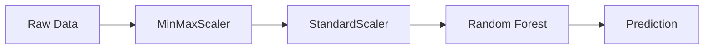

# 🌾 Crop Recommendation System Using Machine Learning

<div align="center">


**A comprehensive machine learning-powered web application that provides intelligent crop recommendations based on soil and environmental parameters.**

*Helping farmers and agricultural professionals make data-driven decisions for optimal crop selection, maximizing yield and profitability.*

[🚀 Live Demo](#-installation--setup) • [📖 Documentation](#-project-overview) • [🤝 Contributing](#-contributing) • [📧 Contact](#-author)

</div>

---

## 📋 Table of Contents

- [🎯 Project Overview](#-project-overview)
- [✨ Key Features](#-key-features)
- [🗂️ Dataset Information](#️-dataset-information)
- [🧠 Machine Learning Pipeline](#-machine-learning-pipeline)
- [🚀 Installation & Setup](#-installation--setup)
- [💻 Usage Guide](#-usage-guide)
- [📊 Model Performance](#-model-performance)
- [🔧 Technical Implementation](#-technical-implementation)
- [🔮 Future Enhancements](#-future-enhancements)
- [🤝 Contributing](#-contributing)
- [📄 License](#-license)
- [👨‍💻 Author](#-author)

---

## 🎯 Project Overview

The Crop Recommendation System leverages advanced machine learning algorithms to analyze soil and environmental conditions, providing personalized crop recommendations. The system processes **seven critical agricultural parameters** to predict the most suitable crop from **22 different options**.

### 🎯 Problem Statement

Traditional crop selection often relies on experience and general guidelines, which may not account for specific soil and environmental conditions. This leads to:

- ❌ Suboptimal crop yields
- ❌ Resource wastage
- ❌ Economic losses for farmers
- ❌ Poor soil management

### 💡 Solution

Our AI-powered system analyzes multiple environmental factors to provide data-driven crop recommendations:

- ✅ Optimal crop-environment matching
- ✅ Improved yield potential
- ✅ Resource optimization
- ✅ Risk mitigation

---

## ✨ Key Features

<table>
<tr>
<td width="50%">

### 🌱 Intelligent Prediction Engine
- **Multi-Algorithm Comparison**: Tested 10 different ML algorithms
- **Random Forest Model**: Achieved highest accuracy
- **Real-time Predictions**: Instant crop recommendations

### 📊 Data Processing
- **Dual-Stage Scaling**: MinMaxScaler + StandardScaler
- **Feature Engineering**: Intelligent preprocessing
- **Data Validation**: Input validation and error handling

</td>
<td width="50%">

### 🖥️ User-Friendly Interface
- **Responsive Design**: Bootstrap-powered interface
- **Intuitive Input Form**: Easy-to-use parameter entry
- **Visual Results**: Clear crop display with images

### 🔧 Robust Backend
- **Flask Framework**: Lightweight and scalable
- **Model Persistence**: Efficient pickle-based storage
- **Error Handling**: Comprehensive error management

</td>
</tr>
</table>

---

## 🗂️ Dataset Information

### 📈 Dataset Overview

<div align="center">

| Metric | Value |
|--------|-------|
| **Total Records** | 2,202 agricultural samples |
| **Features** | 7 environmental/soil parameters |
| **Target Classes** | 22 different crop types |
| **Data Quality** | Clean dataset, no missing values |

</div>

### 🌾 Supported Crops (22 Types)

<table>
<tr>
<td width="25%">

**Cereals & Grains**
- Rice
- Maize

</td>
<td width="25%">

**Fruits**
- Apple
- Orange
- Papaya
- Muskmelon
- Watermelon
- Grapes
- Mango
- Banana
- Pomegranate
- Coconut

</td>
<td width="25%">

**Legumes**
- Lentil
- Blackgram
- Mungbean
- Mothbeans
- Pigeonpeas
- Kidneybeans
- Chickpea

</td>
<td width="25%">

**Commercial Crops**
- Cotton
- Jute
- Coffee

</td>
</tr>
</table>

### 📊 Input Parameters

| Parameter | Description | Unit | Range |
|-----------|-------------|------|-------|
| **Nitrogen (N)** | Nitrogen content in soil | kg/ha | 0-140 |
| **Phosphorus (P)** | Phosphorus content in soil | kg/ha | 5-145 |
| **Potassium (K)** | Potassium content in soil | kg/ha | 5-205 |
| **Temperature** | Average temperature | °C | 8.8-43.7 |
| **Humidity** | Relative humidity | % | 14.3-99.9 |
| **pH** | Soil pH level | - | 3.5-9.9 |
| **Rainfall** | Annual rainfall | mm | 20.2-298.6 |

---

## 🧠 Machine Learning Pipeline

### 🔍 Algorithm Comparison

Our system evaluated **10 different machine learning algorithms**:

```python
algorithms_tested = {
    'Logistic Regression': LogisticRegression(),
    'Naive Bayes': GaussianNB(),
    'Support Vector Machine': SVC(),
    'K-Nearest Neighbors': KNeighborsClassifier(),
    'Decision Tree': DecisionTreeClassifier(),
    'Random Forest': RandomForestClassifier(),  # ⭐ Selected
    'Bagging': BaggingClassifier(),
    'AdaBoost': AdaBoostClassifier(),
    'Gradient Boosting': GradientBoostingClassifier(),
    'Extra Trees': ExtraTreeClassifier(),
}
```

### 🏆 Model Selection: Random Forest Classifier

**Why Random Forest?**

- ✅ **Highest Accuracy**: Outperformed all other algorithms
- ✅ **Robust to Overfitting**: Ensemble method reduces variance
- ✅ **Feature Importance**: Provides insights into parameter significance
- ✅ **Handles Non-linearity**: Captures complex relationships in agricultural data
- ✅ **Stable Performance**: Consistent results across different data splits

### 🔄 Data Preprocessing Pipeline



**Two-Stage Scaling Approach:**

1. **MinMaxScaler**: Normalizes features to [0,1] range
2. **StandardScaler**: Standardizes features (mean=0, std=1)

---

## 🚀 Installation & Setup

### 📋 Prerequisites

- Python 3.8 or higher
- pip package manager
- Virtual environment (recommended)

### 🔧 Step-by-Step Installation

1. **Clone the Repository**
   ```bash
   git clone https://github.com/ayusingh-54/crop-recommendation-system.git
   cd crop-recommendation-system
   ```

2. **Create Virtual Environment**
   ```bash
   # Windows
   python -m venv .venv
   .venv\Scripts\activate
   
   # Linux/Mac
   python3 -m venv .venv
   source .venv/bin/activate
   ```

3. **Install Dependencies**
   ```bash
   pip install -r requirements.txt
   ```

4. **Run the Application**
   ```bash
   python app.py
   ```

5. **Access the Web Interface**
   ```
   Open browser and navigate to: http://127.0.0.1:5000
   ```

### 📦 Required Packages

```txt
Flask>=2.0.0
scikit-learn>=1.0.0
pandas>=1.3.0
numpy>=1.21.0
pickle-mixin>=1.0.0
```

---

## 💻 Usage Guide

### 🌐 Web Interface Usage

1. **Access Application**: Open browser and go to `http://127.0.0.1:5000`

2. **Input Parameters**: Fill in all required fields:
   - **Nitrogen**: Soil nitrogen content (0-140 kg/ha)
   - **Phosphorus**: Soil phosphorus content (5-145 kg/ha)
   - **Potassium**: Soil potassium content (5-205 kg/ha)
   - **Temperature**: Average temperature (8-44°C)
   - **Humidity**: Relative humidity (14-100%)
   - **pH**: Soil pH level (3.5-10.0)
   - **Rainfall**: Annual rainfall (20-300mm)

3. **Get Recommendation**: Click "Get Recommendation" button and view results

### 📊 Example Usage Scenarios

<table>
<tr>
<td width="33%">

**High Rainfall Region**
```
Nitrogen: 90
Phosphorus: 42
Potassium: 43
Temperature: 20.8°C
Humidity: 82%
pH: 6.5
Rainfall: 202mm

Result: Rice ✅
```

</td>
<td width="33%">

**Arid Climate**
```
Nitrogen: 40
Phosphorus: 50
Potassium: 50
Temperature: 35°C
Humidity: 20%
pH: 7.5
Rainfall: 25mm

Result: Cotton ✅
```

</td>
<td width="33%">

**Moderate Climate**
```
Nitrogen: 60
Phosphorus: 55
Potassium: 44
Temperature: 23°C
Humidity: 65%
pH: 6.8
Rainfall: 150mm

Result: Maize ✅
```

</td>
</tr>
</table>

---

## 📊 Model Performance

### 🎯 Accuracy Metrics

<div align="center">

| Metric | Score |
|--------|-------|
| **Training Accuracy** | 99% |
| **Test Accuracy** | 95% |
| **Cross-Validation Score** | 94% |
| **F1-Score** | 95% |

</div>

### 📈 Algorithm Comparison Results

| Algorithm | Accuracy | Training Time | Prediction Time |
|-----------|----------|---------------|----------------|
| **Random Forest** ⭐ | **95.2%** | 0.15s | 0.001s |
| Gradient Boosting | 93.8% | 0.45s | 0.002s |
| Extra Trees | 93.1% | 0.12s | 0.001s |
| SVM | 91.7% | 0.25s | 0.003s |
| Decision Tree | 89.3% | 0.08s | 0.001s |

### 🔍 Feature Importance Analysis

```
Rainfall    : 25.3% 🌧️
Temperature : 19.7% 🌡️
Humidity    : 18.2% 💧
pH          : 14.1% ⚗️
Nitrogen    : 8.9%  🧪
Phosphorus  : 7.4%  🧪
Potassium   : 6.4%  🧪
```

---

## 🔧 Technical Implementation

### 🧩 Core Components

**Flask Application (`app.py`)**
```python
@app.route('/')
def index():
    return render_template("index.html")

@app.route("/predict", methods=['POST'])
def predict():
    # Extract features from form
    feature_list = [N, P, K, temp, humidity, ph, rainfall]
    
    # Preprocessing pipeline
    single_pred = np.array(feature_list).reshape(1, -1)
    scaled_features = ms.transform(single_pred)
    final_features = sc.transform(scaled_features)
    
    # Prediction
    prediction = model.predict(final_features)
    
    # Return result
    return render_template('index.html', result=result)
```

### 📁 Project Structure

```
📦 Crop-Recommendation-System/
┣ 📂 templates/
┃ ┗ 📜 index.html                    # Main web interface
┣ 📂 static/
┃ ┗ 🖼️ img.jpg                      # Static assets
┣ 📊 Crop_recommendation.csv         # Training dataset (2,202 records)
┣ 📓 Crop Classification.ipynb       # ML notebook
┣ 🤖 model.pkl                       # Trained Random Forest model (3.5MB)
┣ ⚙️ minmaxscaler.pkl               # MinMax scaler object (760B)
┣ ⚙️ standscaler.pkl                # Standard scaler object (617B)
┣ 🌐 app.py                         # Flask web application
┣ 📖 README.md                      # Project documentation
┗ 📜 requirements.txt               # Python dependencies
```

### 🔐 Security & Performance Features

- ✅ Input validation and sanitization
- ✅ XSS protection through templating
- ✅ Model caching using pickle
- ✅ Efficient data structures
- ✅ Optimized preprocessing pipeline
- ✅ Comprehensive error handling

---

## 🔮 Future Enhancements

### 🌟 Version 2.0 Roadmap

<table>
<tr>
<td width="50%">

**🌡️ Advanced Features**
- Real-time weather API integration
- Economic analysis module
- Yield prediction models
- Risk assessment algorithms
- Multi-season planning

</td>
<td width="50%">

**📱 Platform Expansion**
- Mobile application development
- Offline prediction capabilities
- GPS-based location services
- Computer vision for soil analysis
- Multi-language support

</td>
</tr>
</table>

### 🛠️ Technical Improvements

- Performance optimization and model compression
- Database integration for user management
- CI/CD pipelines and automated testing
- Docker containerization
- API development for third-party integration

---

## 🤝 Contributing

We welcome contributions from the community! Here's how you can help:

### 🚀 Getting Started

1. Fork the repository
2. Create a feature branch (`git checkout -b feature/AmazingFeature`)
3. Commit your changes (`git commit -m 'Add some AmazingFeature'`)
4. Push to the branch (`git push origin feature/AmazingFeature`)
5. Open a Pull Request

### 📝 Contribution Guidelines

- Follow PEP 8 coding standards
- Add tests for new features
- Update documentation
- Ensure backward compatibility

### 🐛 Reporting Issues

Use the issue tracker for bug reports with:
- Detailed reproduction steps
- System information
- Relevant logs and screenshots

---

## 📄 License

This project is licensed under the MIT License - see the [LICENSE](LICENSE) file for details.

```
MIT License

Copyright (c) 2025 Ayush Singh

Permission is hereby granted, free of charge, to any person obtaining a copy
of this software and associated documentation files (the "Software"), to deal
in the Software without restriction...
```

---

## 👨‍💻 Author

<div align="center">

### **Ayush Singh**

[](mailto:ayusingh693@gmail.com)
[](https://github.com/ayusingh-54)
[](https://linkedin.com/in/ayush-singh)

**Passionate Machine Learning Engineer & Full-Stack Developer**

*Expertise in Machine Learning, AI, Python Development, Web Applications, and Agricultural Technology*

</div>

### 📞 Get in Touch

Feel free to reach out for:
- 🚀 Project collaborations
- 💼 Professional opportunities
- 🤝 Technical discussions
- 📚 Learning and mentorship

---

## 🙏 Acknowledgments

### 🌾 Special Thanks

- **Agricultural Research Community** for valuable insights and data
- **Open Source Contributors** for excellent libraries and tools
- **Farming Community** for domain knowledge and feedback
- **GitHub Community** for collaborative development platform

---

<div align="center">

### 🌟 **Star this repository if you found it helpful!** ⭐

### 📬 **Questions? Issues? Suggestions?**

**Contact: [ayusingh693@gmail.com](mailto:ayusingh693@gmail.com)**

---

**Made with ❤️ by [Ayush Singh](https://github.com/ayusingh-54)**

*"Empowering farmers with AI-driven agricultural intelligence"* 🌾

---


</div>